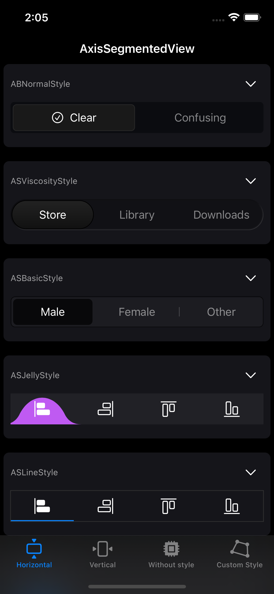
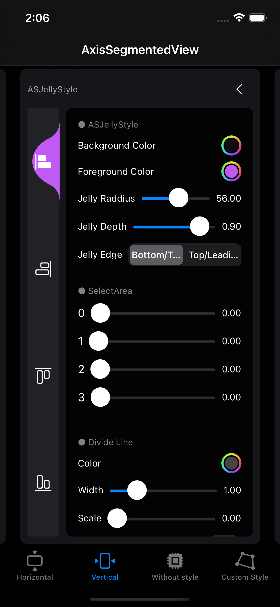
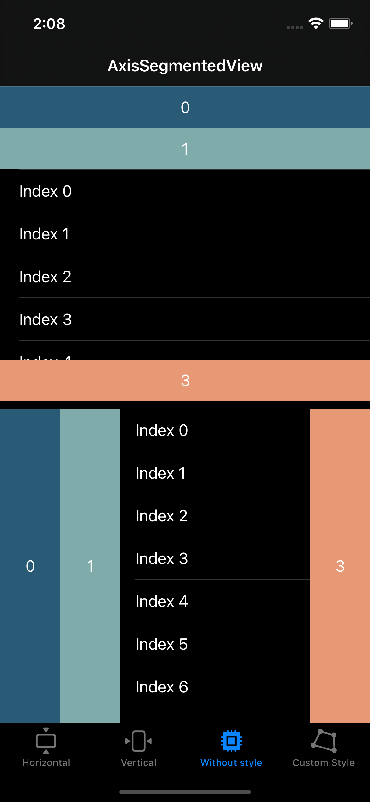

# **AxisSegmentedView for SwiftUI**
A library that allows you to easily create various styles of segmented views. Supports iOS, macOS and tvOS.

[](https://developer.apple.com/macOS)
[](https://developer.apple.com/iOS)
[](https://developer.apple.com/macOS)
[](https://developer.apple.com/tvOS)
[](https://www.instagram.com/dev.fabula)
[](https://developer.apple.com/documentation/swift_packages/package/)
[](https://opensource.org/licenses/MIT)  

## Screenshot
|Horizontal|Vertical|For use without style|
|:---:|:---:|:---:|
||||


https://user-images.githubusercontent.com/1617304/160249891-a2fe15f2-5b07-4c2c-a204-fa9bd8981989.mov


## Example
[https://fabulaapp.page.link/234](https://fabulaapp.page.link/234)

## Usages
```swift
AxisSegmentedView(selection: $selection, constant: .init()) {
    Image(systemName: "align.horizontal.left")
        .itemTag(0, selectArea: 0) {
            Image(systemName: "align.horizontal.left.fill")
        }
    Image(systemName: "align.horizontal.right")
        .itemTag(1, selectArea: 160) {
            Image(systemName: "align.horizontal.right.fill")
        }
    Image(systemName: "align.vertical.top")
        .itemTag(2, selectArea: 0) {
            Image(systemName: "align.vertical.top.fill")
        }
    Image(systemName: "align.vertical.bottom")
        .itemTag(3, selectArea: 160) {
            Image(systemName: "align.vertical.bottom.fill")
        }
} style: {
    ASBasicStyle()
}
.frame(height: 44)
```

## Usages - For use without style
```swift
var listView: some View {
    List(0...100, id: \.self) { index in
        Button {
            print("click")
        } label: {
            Text("Index \(index)")
        }
    }.listStyle(.plain)
}
    
AxisSegmentedView(selection: $selection, constant: .init()) {
    Rectangle()
        .overlay(
            Text("0")
        )
        .itemTag(0, selectArea: maxArea1) {
            Rectangle()
                .overlay(
                    Text("0")
                )
        }
    Rectangle()
        .overlay(
            Text("1")
        )
        .itemTag(1, selectArea: maxArea1) {
            listView
        }
    Rectangle()
        .overlay(
            Text("2")
        )
        .itemTag(2, selectArea: maxArea1) {
            listView
        }
    Rectangle()
        .overlay(
            Text("3")
        )
        .itemTag(3, selectArea: maxArea1) {
            listView
        }
}
```
  
## Swift Package Manager
The Swift Package Manager is a tool for automating the distribution of Swift code and is integrated into the swift compiler. Once you have your Swift package set up, adding AxisSegmentedView as a dependency is as easy as adding it to the dependencies value of your Package.swift.

```swift
dependencies: [
    .package(url: "https://github.com/jasudev/AxisSegmentedView.git", .branch("main"))
]
```

## Contact
instagram : [@dev.fabula](https://www.instagram.com/dev.fabula)  
email : [dev.fabula@gmail.com](mailto:dev.fabula@gmail.com)

## License
AxisSegmentedView is available under the MIT license. See the [LICENSE](LICENSE) file for more info.
